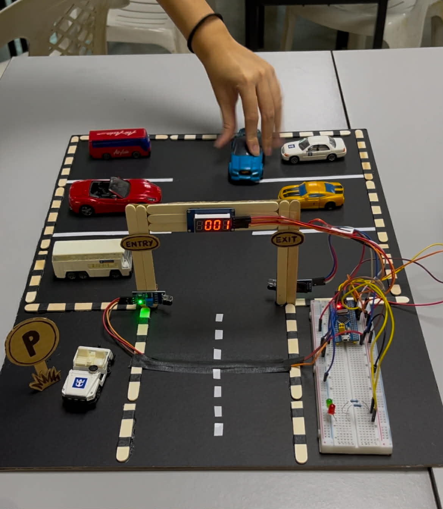

# STM32 Parking System (Bare-Metal C)

## 📌 Overview
This project implements a parking system using STM32 microcontroller with bare-metal C programming.

## ⚙️ Features
- GPIO-based input/output control
- Real-time parking slot detection
- Embedded system design without HAL (bare-metal)

## 🛠️ Technologies Used
- STM32 Microcontroller
- C Programming (Bare-Metal)
- Keil uVision

## 📷 Demo

## 🚀 How It Works
The system detects parking availability through input signals and controls output indicators accordingly using direct register-level programming.

## 📎 Notes
This project focuses on low-level embedded programming without using high-level libraries.
